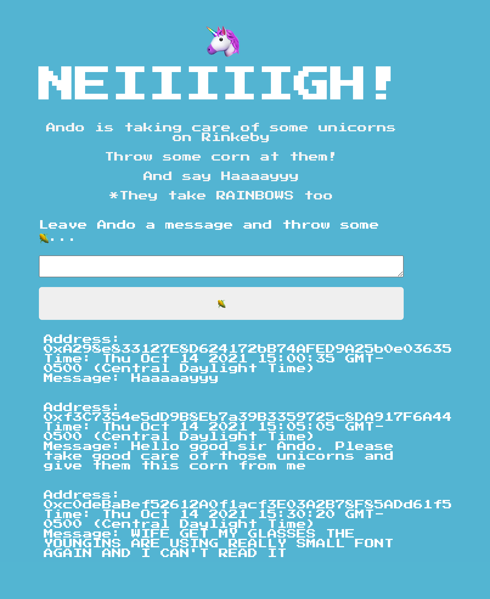

# first_smart_contract_ever
Smart Contract UI

This project deploys a Solidity + Ethereum Smart Contract that allows users to connect their MetaMask wallet 
to Ando's feeding ground for unicorns on Rinkeyby Ethereum Network (using Fake Eth).

You can feed the unicorns corn and leave Ando a message. 

*And you might win some (fake) Eth!

